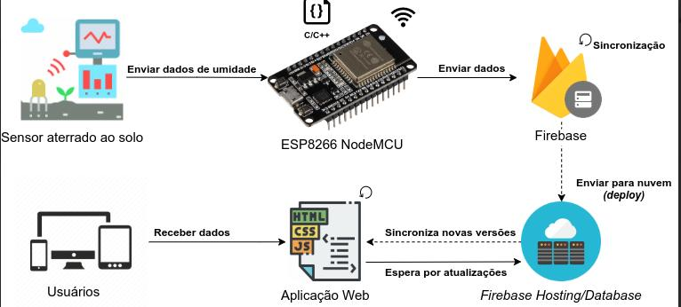
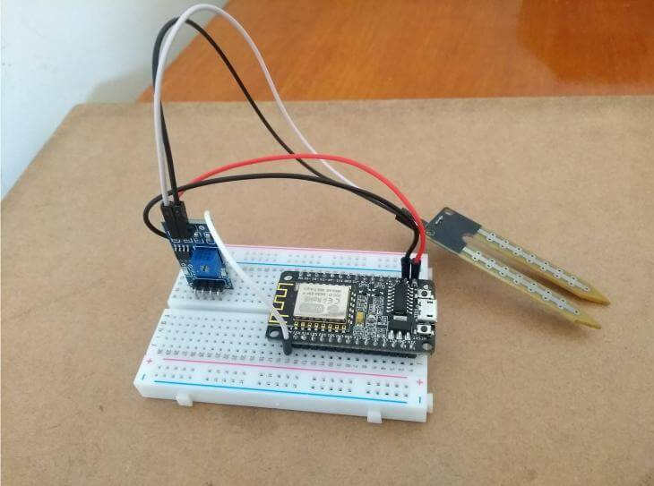

<h1 align="center">:seedling: Real-time Soil Moisture :seedling:</h1>

Real-time soil moisture sensing using NodeMCU and Firebase

## Abstract

Aiming to provide a better use of water, this work presents the development of a prototype for soil moisture monitoring using wireless technology and low cost materials. Soil moisture is a determining factor to provide acceptable conditions for the development of any cultivated vegetative system. Based on Internet of Things principles, the hardware consists of a ESP8266 NodeMCU microcontroller that controls a hygrometer sensor to collect soil moisture data. The management and control of states and information of these devices is done through a web application, which connected to a real-time database of Firebase platform enables efficient handling of water resources and enables remote monitoring of humidity. Data saved in the cloud is used to generate charts for studies by agricultural professionals.

*Key-words: Internet of Things, Soil Moisture, Smart Farming*

## How it works

The figure below shows the architecture of the project, where it is possible to identify that the proposed system consists of several modules, with the main components being the ESP8266 NodeMCU module, the FC-28 sensor (grounded to the soil), the Firebase platform for real-time data storage and synchronization, as well as sending new versions to the cloud, and simultaneously, the web interface that will display the data to the user(s).

    

The sensor reads the soil moisture, performs digital-to-analog conversion on this data, and sends it to the ESP8266 NodeMCU module, where it is validated through its embedded code before sending this data to the Firebase database over the Internet (Wi-Fi). Firebase will always be synchronizing new data to provide the latest information for the application. Through the Firebase SDK, you can write JavaScript code to connect to the project and access the sensor's collected data.

ESP8266, NodeMCU, FC-28 sensor (grounded to ground), Firebase platform for storage and synchronize data in real time in addition to sending new versions to the cloud and, concomitantly, a Web interface that will show the data to the user(s).

## Resources

[📑 Document (PT-BR)](https://drive.google.com/file/d/1zB9DE51rqrBGq1AfeP0QTntwUyFR6xUm/view?usp=sharing)

    

